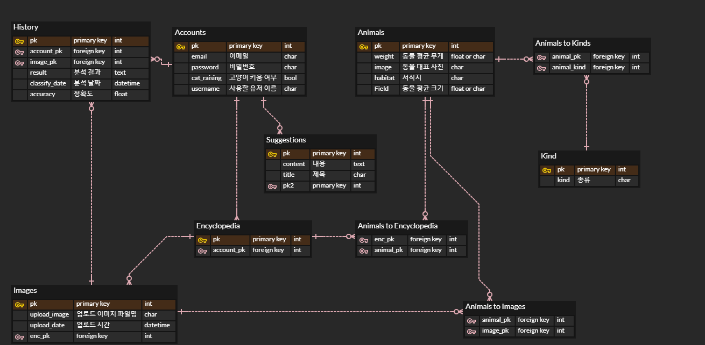

# README

> Sub 2

### 1. 개요

- 고양이 사진으로 종류 판별
- 내가 사용했던 사진들 모아서 보여줌
- 결과물 SNS 게시

### 2. 사용 기술(예정)

- Python(ML)
- Django(Sqlite)
- Vue.js

### 3. ERD(ver1.0)

> 1차 ERD

### 4. Django에서 사용할 라이브러리들

- django-cors-headers
- djangoframework